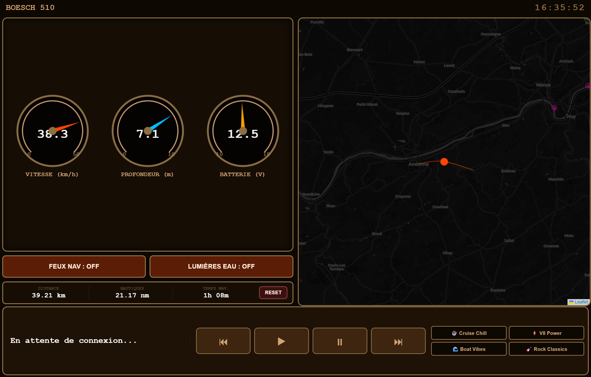

# Morioo MMS — Marine Management System



## Overview

Dashboard tactile embarqué pour le *Boesch 510* (1964, V8 Crusader/Indmar). Tourne sur un Raspberry Pi monté en baie 1-DIN, affiché sur un autoradio **Ainavi K40** via AABrowser (Android Auto, Pixel 8).

**Fonctionnalités :**
- Jauges temps réel : vitesse (km/h), profondeur (m), tension batterie (V)
- Carte nautique live (Leaflet + OpenSeaMap) avec suivi du bateau (type Waze)
- Contrôle pompe de cale (arrêt auto 30 s) et feux sous-marins OceanLED X-Series
- ⚓ Alarme de mouillage (anchor watch) — dérive + alarme visuelle et sonore
- 🌤 Météo en temps réel (chip top bar + popup prévisions 3h)
- Compteur ODO (km, nautiques, temps de navigation) avec reset
- Lecture Spotify avec contrôle playback et playlists
- 🌓 Thème **jour/nuit automatique** selon lever/coucher du soleil (calcul astronomique GPS)
- Layout responsive : mobile, tablette, desktop, Ainavi K40 (1280×480)
- Architecture modulaire — extensions isolées dans `modules/`

---

## Stack technique

| Couche | Technologie |
|--------|-------------|
| Backend | FastAPI (Python 3.13) + `pyserial` |
| Frontend | HTML5 + Canvas + Leaflet + vanilla JS, variables CSS thème |
| Matériel | Raspberry Pi 3, Ainavi K40, Wemos D1 Mini + shield relais |
| Musique | Spotify API via `spotipy` |
| Android | Kotlin — WebView (téléphone) + Car App Library 1.4.0 (Android Auto) |

---

## Restore après crash

```bash
git clone https://github.com/oli1313/morioo_mms /home/ode/boesch_os
bash /home/ode/boesch_os/install/restore.sh
sudo reboot
```

Le script remet en place :
- Paquets système (`xdotool`, `fonts-noto-color-emoji`, `avahi-daemon`, etc.)
- Environnement Python (venv + dépendances)
- Service systemd `boesch_backend.service` (démarrage automatique, watchdog 30 s)
- Règle udev pour le Wemos (port USB stable via `by-id`)
- Cron de refresh Chromium toutes les 5 minutes

> **Spotify :** token non versionné. Après restore → `http://<IP-RASP>:8000/login` pour ré-authentifier.

---

## Installation manuelle (dev)

```bash
git clone https://github.com/oli1313/morioo_mms /home/ode/boesch_os
cd /home/ode/boesch_os
python3 -m venv venv
venv/bin/pip install -r requirements.txt
venv/bin/python main.py          # → http://<IP>:8000/
```

---

## Structure du repo

```
.
├── main.py                      # Backend FastAPI — cœur + chargement modules
├── requirements.txt
├── CLAUDE.md                    # Guide contributeur (archi, pièges, sécurité)
├── modules/
│   ├── anchor_watch.py/.js      # Alarme de mouillage
│   └── weather.py/.js           # Météo temps réel
├── templates/
│   └── index.html               # Dashboard complet (responsive, thème auto)
├── relais_usb/
│   └── relais_usb.ino           # Firmware Wemos D1 Mini
├── install/
│   ├── restore.sh               # Restore complet
│   ├── boesch_backend.service   # Systemd (Type=notify + watchdog)
│   └── 99-wemos.rules           # Udev CH340 → /dev/ttyWEMOS
├── android/
│   └── app/src/main/kotlin/com/morioo/mms/
│       ├── MoriooApp.kt         # Application class (init SharedPreferences)
│       ├── AppPreferences.kt    # URL Pi configurable (SharedPreferences)
│       ├── MainActivity.kt      # WebView plein écran + bouton ⚙
│       ├── SettingsActivity.kt  # Config adresse Pi + test connexion
│       ├── MediaBridgeService.kt# Serveur local 127.0.0.1:8765 — touches média
│       ├── MoriooCarService.kt  # Point d'entrée CarAppService
│       ├── MoriooSession.kt     # Session Android Auto
│       ├── ApiClient.kt         # HTTP vers le Pi
│       ├── DashboardScreen.kt   # Jauges + musique (cliquable → MusicScreen)
│       ├── ControlsScreen.kt    # Pompe, feux, ancre
│       ├── MusicScreen.kt       # Contrôles média via AudioManager
│       ├── MapScreen.kt         # Carte CartoDB Dark (Surface rendering)
│       └── TileCache.kt         # Cache LRU tuiles OSM (80 max)
├── tests/
│   └── smoke_test.py
└── docs/
    └── screenshot.png
```

---

## API

| Méthode | Route | Description |
|---------|-------|-------------|
| `GET` | `/api/status` | Données bateau + trip ODO |
| `GET` | `/api/trail` | Trace GPS |
| `GET` | `/api/diag` | Compteurs de diagnostic + uptime |
| `GET` | `/api/modules` | Modules chargés + URL frontend |
| `POST` | `/api/switch/pompe_de_cale` | Toggle pompe (arrêt auto 30 s) |
| `POST` | `/api/switch/lumieres_sous_marines` | Toggle feux OceanLED |
| `POST` | `/api/trip/reset` | Reset ODO |
| `POST` | `/api/spotify/{action}` | play / pause / next / previous |
| `POST` | `/api/spotify/playlist?playlist_id=` | Lancer une playlist |

Modules :

| Méthode | Route | Description |
|---------|-------|-------------|
| `GET` | `/api/anchor` | État alarme de mouillage |
| `POST` | `/api/anchor/set?radius=` | Poser l'ancre (rayon en m) |
| `POST` | `/api/anchor/clear` | Lever l'ancre |
| `GET` | `/api/weather` | Météo actuelle + prévisions 3h |

---

## Application Android

Un seul APK — deux usages :

1. **App téléphone** : WebView plein écran → dashboard Pi
2. **Android Auto** : interface Car App Library sur l'Ainavi K40 (USB)

### Architecture réseau

```
Hotspot Pixel 8
    ├── Raspberry Pi  rasp-boesch.local:8000  ← API HTTP
    └── Ainavi K40 (Android Auto) ← USB ← Pixel 8
```

### Contrôle Spotify depuis AABrowser

Quand Android Auto a la session Spotify, l'API externe est bloquée. Solution :
`MediaBridgeService` tourne en arrière-plan sur `127.0.0.1:8765`. Le dashboard web
détecte Android (`navigator.userAgent`) et appelle ce bridge local → `AudioManager.dispatchMediaKeyEvent()`.

> **Prérequis** : ouvrir l'app Boesch 510 une fois pour démarrer le service, puis basculer sur AABrowser.

### Connexion réseau

Si `rasp-boesch.local` ne résout pas (DNS_PROBE_FINISHED_NXDOMAIN) :
bouton **⚙** → entrer l'IP directe du Pi (`http://192.168.43.x:8000`) → Tester.

### Sideload en voiture réelle

Google bloque les APKs non-Play-Store dans Android Auto en voiture.
- **AAAD** (Android Auto Apps Downloader) — patche AA pour accepter les sideloads ✅
- Ou : `adb install -i com.android.vending app-debug.apk`
- Activer mode développeur AA : Paramètres → taper 10× sur la version → Sources inconnues

### Build

```bash
cd android
./gradlew assembleDebug
# APK → app/build/outputs/apk/debug/app-debug.apk
adb install app/build/outputs/apk/debug/app-debug.apk
```

> Prérequis : Java 17, Android SDK 35, Kotlin 2.2.10, AGP 8.7.3, Gradle 8.11.1

---

## Thème jour / nuit

Bouton 🌓 dans la top bar — cycle 3 états :

| Bouton | Mode | Comportement |
|--------|------|---|
| 🌓 | Auto (défaut) | Bascule au lever/coucher du soleil (calcul astronomique, position GPS) |
| ☀️ | Forcé jour | Thème clair permanent |
| 🌙 | Forcé nuit | Thème sombre permanent |

Préférence sauvegardée en `localStorage`. La carte swap entre tuiles CartoDB dark/light.

---

## Wemos D1 Mini — Firmware

Le sketch `relais_usb.ino` pilote **deux relais adressés indépendamment** et
écoute sur le port série (115200 baud) des commandes de 2 caractères :
- `P1` / `P0` → relais **pompe de cale** ON / OFF (broche D1)
- `L1` / `L0` → relais **feux sous-marins** ON / OFF (broche D2)

Le préfixe de canal (`P`/`L`) évite que pompe et feux se partagent — et
s'écrasent — le même relais. Le backend envoie ces 2 octets via
`_send_relay(device, state)`.

Port fixé via udev : `/dev/serial/by-id/usb-1a86_USB_Serial-if00-port0`.

---

## TODO matériel

- [x] GPS réel — NMEA `$GPRMC`/`$GNRMC` depuis `/dev/ttyACM0` (u-blox 7)
- [ ] Capteur de profondeur réel — sonar NMEA
- [ ] Tension batterie réelle — lecture analogique Wemos
- [ ] Contrôle couleur OceanLED

---

## Roadmap fonctionnalités

### 🛟 Sécurité
1. ~~⚓ Alarme de mouillage~~ — ✅ `anchor_watch`
2. ~~🌤 Météo temps réel~~ — ✅ `weather`
3. **🌊 Alarme hauts-fonds** — seuil de profondeur réglable (quand sondeur branché)
4. **🌡️ Surveillance moteur** — température eau/moteur V8 Crusader
5. **🔋 Batterie réelle** — tension mesurée + alerte décharge

### 🧭 Navigation
6. **🧭 Cap (COG) + heure GPS** — boussole de route, heure sans RTC
7. **📊 Stats de sortie** — vitesse max/moy, durée, distance par sortie
8. **🗺️ Export GPX** — partage et relecture des trajets

### 😎 Confort
9. **📷 Caméra de poupe** — aide à l'accostage
10. **🎚️ Contrôle couleur OceanLED** — ambiance projecteurs sous-marins

---

## Licence
Projet privé — usage personnel sur le *Boesch 510*. Redistribution interdite sans autorisation.
